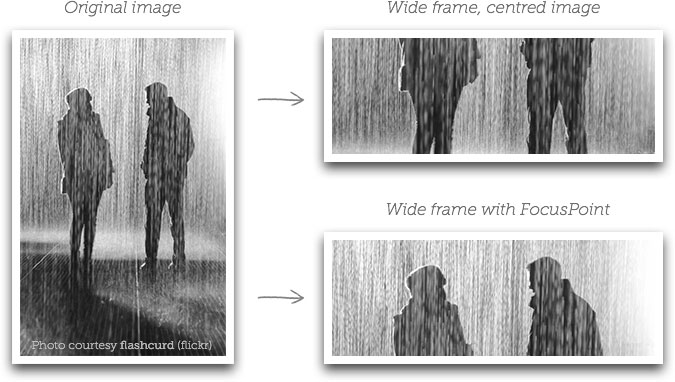
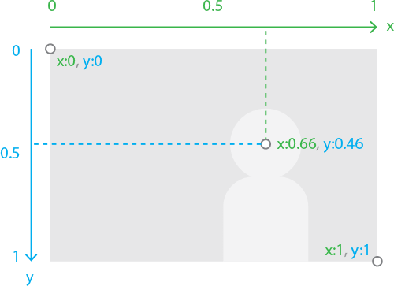
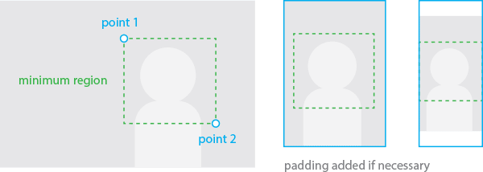

# jQuery FocusPoint 2

## Art direction for flexible image containers



Websites don't have a single layout any more. The space you have for an image may be portrait on a laptop, landscape on a tablet, and square on a mobile - particularly if you're using a full-screen image.

If you have to use the same image file in all these contexts, you might not be happy with the results you get when you 'fill' the allocated space with your image. Your subject might be clipped or completely missing, or just really awkward looking.

FocusPoint makes sure your image looks great in any container, by ensuring the most important part of your image always stays within the frame.

For a quick overview of the plugin check out this [video by Petr Tichy](http://youtu.be/Wxmxsw65BQw?t=6m49s).

## Examples

Here are some examples showing the same image cropped a variety of different ways at once. Make sure you play with resizing the browser window to get a feel for what FocusPoint does.

* [Lizard](http://jonom.github.io/jquery-focuspoint/demos/grid/lizard.html)
* [Kangaroo](http://jonom.github.io/jquery-focuspoint/demos/grid/kangaroo.html)
* [Dolphin](http://jonom.github.io/jquery-focuspoint/demos/grid/dolphin.html)
* [Bird](http://jonom.github.io/jquery-focuspoint/demos/grid/bird.html)

And here is a [full screen](http://jonom.github.io/jquery-focuspoint/demos/full-screen/index.html) demo.

## In the wild

FocusPoint helps with art direction on [Adele's website](http://adele.com/home/).

Are you using FocusPoint on a cool or high profile website? [Let me know!](http://jonathonmenz.com)

## How does it work?

The idea is that most images have a focal point or subject that is the most important part of the image. In the case of a traditional portrait photo this would be the subject's face (or specifically the spot right between their eyes). In the image above it's arguably the point halfway between the two people's faces.

FocusPoint requires you to indicate where this focal point is located within your image, and then works in the background to ensure that point is never cropped out.

## How to use

#### 1. Calculate your image's focus point

An image's focus point is made up of `x` (horizontal) and `y` (vertical) coordinates. The value of a coordinate can be a decimal point number anywhere between `0` and `1` and works similar to positioning in CSS. On the `x` axis `0` means the left edge and `1` means the right, while on the `y` axis `0` means the top and `1` means the bottom. On both axes `0.5` indicates the center.



*Note: Version 1 of this plugin used a different grid and coordinate system. If you like you can keep using the old system by using the `legacyGrid` setting (see below).*

**Sound hard?** Don't worry, you can easily find the focus point coordinates of any image by using the [helper tool](http://jonom.github.io/jquery-focuspoint/demos/helper/index.html) *(courtesy of [@auginator](https://github.com/auginator)).*

#### 2. Include javascript and CSS

You'll need to include jQuery (v1.9 or greater), the FocusPoint script, and FocusPoint css file. Example:

```html
<link rel="stylesheet" href="focuspoint.css">
<script src="jquery.js"></script>
<script src="focuspoint.js"></script>
```

#### 3. Mark up your image container

Specify the image dimensions and focus point coordinates on the image container. The image will take up whatever space is available in the container, so make sure there is some space to fill by setting a height for the container in your CSS. Example:

```html
<div class="focuspoint"
data-focus-x="0.331"
data-focus-y="0.224"
data-image-w="400"
data-image-h="300">
	
</div>
```

Note: setting `data-image-w` and `data-image-h` is optional but recommended. Omitting these value means your image will not be positioned correctly inside the frame until it has finished loading, which may cause a visible jump.

#### 4. Fire FocusPoint plugin

Usually the best place for this will be inside your `$(document).ready()` function.

```javascript
//Fire plugin
$('.focuspoint').focusPoint();
```

That's it!

#### Configuration options

FocusPoint comes with a few options you can change to suit your needs.

| Option                 | Values                | Default | Description |
| ---------------------- | --------------------- | ------- | ----------- |
| `reCalcOnWindowResize` | `true` or `false`     | `true`  | Whether or not to re-adjust image when the window is resized. |
| `throttleDuration`     | Int e.g. `0` or `100` | `17`    | Throttling rate in milliseconds. Set to `0` to disable throttling. This is a global setting. |
| `setTransformOrigin`   | `true` or `false`     | `true`  | Whether or not to set the images transform origin to match the focus point. This allows for easy zooming from the focus point with css transforms. |
| `legacyGrid`   | `true` or `false`     | `false`  | Set to true to use FocusPoint v1 style coordinates and grid system. |

Example usage:

```javascript
$('.focuspoint').focusPoint({
	throttleDuration: 100 //re-focus images at most once every 100ms.
});
```

#### FocusPoint functions

Once you have initialised FocusPoint on an image container you can access FocusPoint methods like this: `$(someContainer).data('focusPoint').methodName()`.

Or the shorter way, like this: `$(someContainer).focusPoint('methodName')`

| Function        | Description |
| --------------- | ----------- |
| `adjustFocus()` | Re-do calculations and re-position an image in it's frame. Should be called when container dimensions change. |
| `windowOn()`    | Start window event listener to automatically re-focus this image when window is resized |
| `windowOff()`   | Stop re-focusing image when window is resized |

## Advanced usage

#### Minimum cropping region

Suppose you have an image that looks okay in a square or portrait frame, but it really doesn't work in a landscape container, due to lack of vertical negative space in the image. In that case you might want the image to fill the frame for square or portrait aspect ratios, but only partially fill the frame in landscape ones. You can do this by specifying a minimum cropping region. All you need to do is pass two comma separated `x` coordinates and/or two `y` coordinates instead of one.



[See an example](http://jonom.github.io/jquery-focuspoint/demos/test/index.html)

#### Using FocusPoint in content sliders

Currently FocusPoint can't do it's calculations properly if an image container or it's parent is set to `display:none`, as it won't have any dimensions. This can cause problems with sliders that hide non-active slides. A work-around for now is to trigger `adjustFocus()` on the image container as soon as it become visible.

## Tips & Tricks

#### Image composition
In order for this concept of 'fluid cropping' to work well, your images will need to include some negative space around the subject that you are happy to be cropped out when necessary. You don't need space on every side of the subject - but for maximum flexibility you'll want to include both some vertical and horizontal negative space.

#### Pure CSS alternative

You can get a similar effect to this technique using only CSS and the `background-position` and `background-size` properties. Browser support isn't as good (at the moment) and your image won't be positioned exactly the same way - but it's pretty close. The CSS technique leans towards preserving the original composition while FocusPoint is biased towards keeping the subject of the image in the centre of the frame. Depending on your requirements either technique may suit you better.

* [Pure CSS example and comparison](http://jonom.github.io/jquery-focuspoint/demos/css-js-comparison/index.html)
* [Helper tool for calculating CSS values](http://jonom.github.io/jquery-focuspoint/demos/helper/index.html)

#### SilverStripe CMS integration

This plugin plays really well with the [silverstripe-focuspoint](https://github.com/jonom/silverstripe-focuspoint) module, which lets you set the focuspoint on any image with just a click, and makes the info available in your front-end templates so you don't have to do any math. It also provides really easy 'destructive' cropping outputting resampled images cropped to a particular width and height based on the same logic.

## Feedback welcome!

Nothing would encourage me to keep updating this script more than hearing how it's been used in the real world. Get in touch with me at [jonathonmenz.com](http://jonathonmenz.com) to let me know how you've used this plugin or any suggestions you have for improving it. Please [report bugs or issues on github](https://github.com/jonom/jquery-focuspoint/issues).

**Note:** To date I'm not yet aware of any live websites (apart from my own) that use this plugin - so please get in touch if you launch a site that uses FocusPoint!

#### Tip jar

If FocusPoint helped you impress a client and you want to say thanks, you're welcome to [leave a small donation](https://www.paypal.com/cgi-bin/webscr?cmd=_s-xclick&hosted_button_id=5VUDD3ACRC4TC) to help fund the purchase of coffee, which will help me stay awake during future development.

[](https://www.paypal.com/cgi-bin/webscr?cmd=_s-xclick&hosted_button_id=5VUDD3ACRC4TC)

Donations received / Warm fuzzies generated: **6**  
Caffé Lattes funded: **17** :coffee: :relieved:  
**Thanks!** Daniil, Cohan, Romulo, Lemuel, David